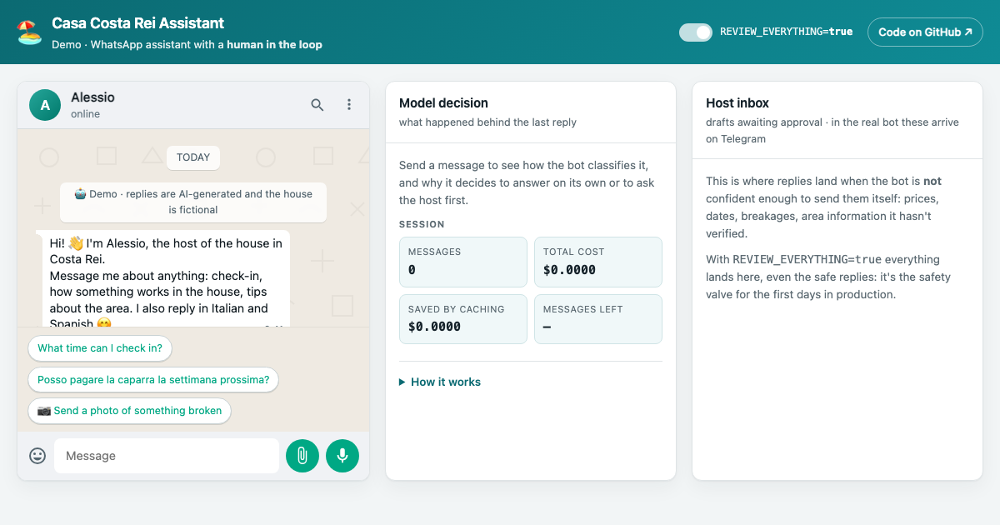

# WhatsApp host assistant

A WhatsApp assistant for a holiday rental in Sardinia that **knows when to ask a
human**. It answers the safe questions on its own (check-in time, how the air
conditioning works, where to park) and turns everything else into a draft the
host approves from Telegram: prices, dates, breakages, anything about the area
it has not verified.

**[Live demo →](https://regal-caramel-543676.netlify.app/)** The demo shows the
part that is normally invisible: what the model decided, why, what it cost, and
the host inbox where a draft waits for approval.



> The demo runs on a fictional house guide. The real one holds the address and
> key-box code of an actual house, so it lives outside this repository.

## Why it is built this way

A guest asking "what time is check-out?" wants an answer now. A guest asking
"can I pay the deposit next week?" must not get an answer invented by a model.
The whole design follows from that split.

**One decision, one line.** Claude classifies the message, picks an action and
writes the draft in a single agentic call, handing it back through a tool rather
than as free text. Whether that draft goes out is one condition, the same one in
every channel:

```js
action === 'invia' && !config.reviewEverything
```

**`REVIEW_EVERYTHING` is the safety valve.** With it on, which is the default,
every reply goes to the host first, even the ones the model considers safe. It
is what you run for the first days in production. The demo puts it in the header
as a switch, so you can watch the same message take both paths.

**When in doubt, escalate.** If the model never calls the tool, or returns an
empty draft, the message is escalated instead of guessed at. An uncertain case
costs the host one notification; a wrong one costs a guest's trust.

**Identity documents are never read.** Guests must send ID photos for the
mandatory Italian police registration. If a photo is a document, the bot stops:
it does not transcribe, describe or summarise anything in it, and just reminds
the host to register it by hand.

**One brain, two providers.** Claude decides everything. Gemini is a narrow
audio-to-text adapter, used only because Claude's API has no audio content
block. Photos go straight to Claude in the same call that classifies and
decides, so the house rules apply identically to text and images.

## Architecture

```
                       ┌─ text ───────────────────────┐
WhatsApp (Baileys) ────├─ photo ──→ (bytes attached)  ├→ allowlist → memory → Claude
                       └─ voice ──→ Gemini transcript ┘                        │
                                                                               ▼
                          send to guest  ←──  or  ──→  draft to host (Telegram)
                                                              │ approved
                                                     learned FAQs → knowledge base
```

`engine.js` takes `sendToClient` and `requestApproval` as callbacks, which is
why the same pipeline drives three channels: WhatsApp, a local REPL, and the web
demo, with no logic duplicated.

## A few things that were not obvious

- **Prompt caching has a minimum.** On Haiku 4.5 the cacheable prefix must reach
  4096 tokens. Below that, `cache_control` is ignored silently: no error, just
  full price on every message. Keeping the knowledge base above that line turned
  the cache on and cut input cost by about 90%.
- **Web search is off on the public demo, by measurement.** Netlify's free tier
  caps a function at 10 seconds total, which streaming does not extend. Measured
  2.4 to 3.5 seconds without search, 7.1 to 10.3 with it, so the tool is dropped
  rather than left to fail at random.
- **The model copies the punctuation it reads.** Telling it not to use em dashes
  did nothing while the prompt itself contained fifteen of them. Removing them,
  and giving examples instead of a prohibition, fixed it.
- **Media never enters the database.** Only a placeholder does. Storing base64
  would bloat the history and resend it on every turn.
- **Unknown numbers cost nothing.** The allowlist is checked before any API call,
  and attachments from unknown numbers are not even downloaded.

## Running it

```bash
npm install
cp .env.example .env      # add ANTHROPIC_API_KEY

npm run brain             # the brain alone, in a local REPL
npm run demo              # the web demo on localhost:8888
npm start                 # the full bot: WhatsApp + Telegram control
npm test                  # 184 tests, offline, under a second
```

The tests never hit the network and never touch real files: the Anthropic and
Gemini SDKs are mocked, and the JSON stores, the database and the house guide
are redirected to a temporary directory.

## Documentation

| | |
|---|---|
| [DEMO.md](DEMO.md) | The web demo: architecture, latency budget, deploy |
| [DEPLOY.md](DEPLOY.md) | Running the bot on a VPS as a systemd service |
| [CLAUDE.md](CLAUDE.md) | Invariants and non-obvious details, for anyone changing the code |

Code, comments and the two documents above are in Italian, like the house they
describe. This README is in English because it is the front door.

## Status

Working on WhatsApp and Telegram, with photo understanding, voice-note
transcription, learned FAQs that expire, and a public web demo. Next: a VPS
deploy to keep it running 24/7.

> Baileys is an unofficial WhatsApp library. The bot only replies to people who
> write first, never sends cold messages, and ignores groups.
